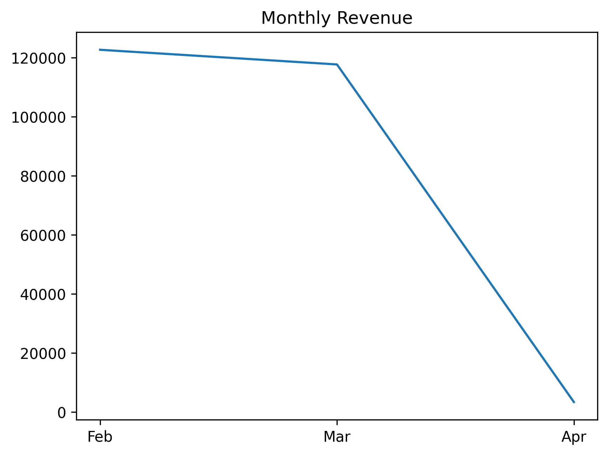
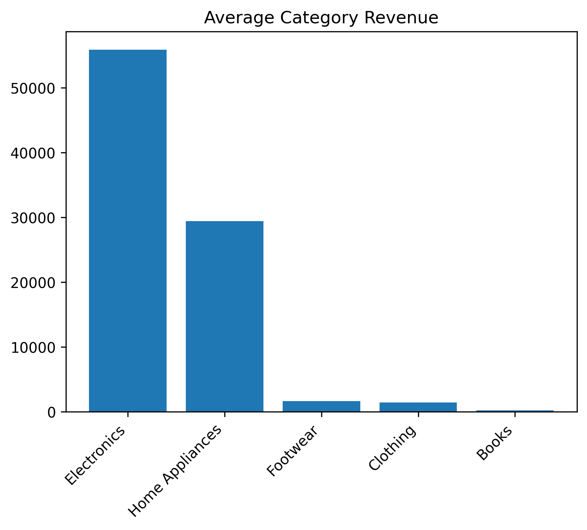
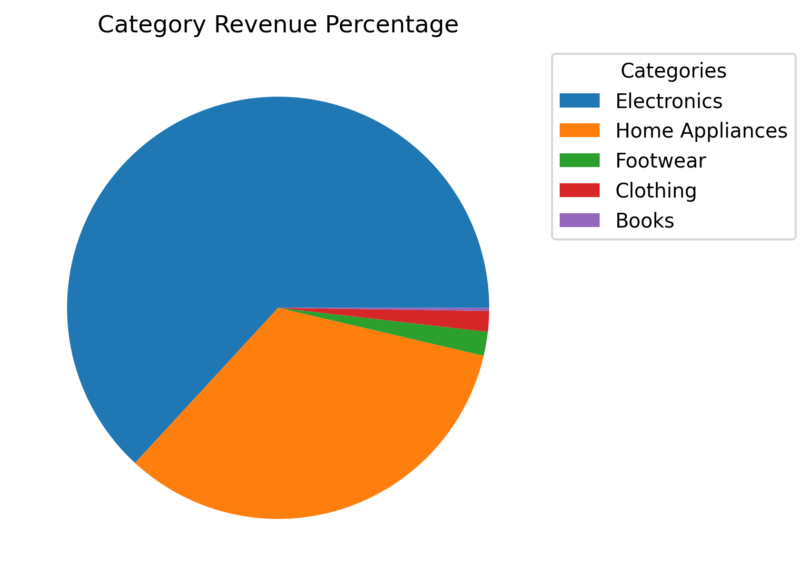
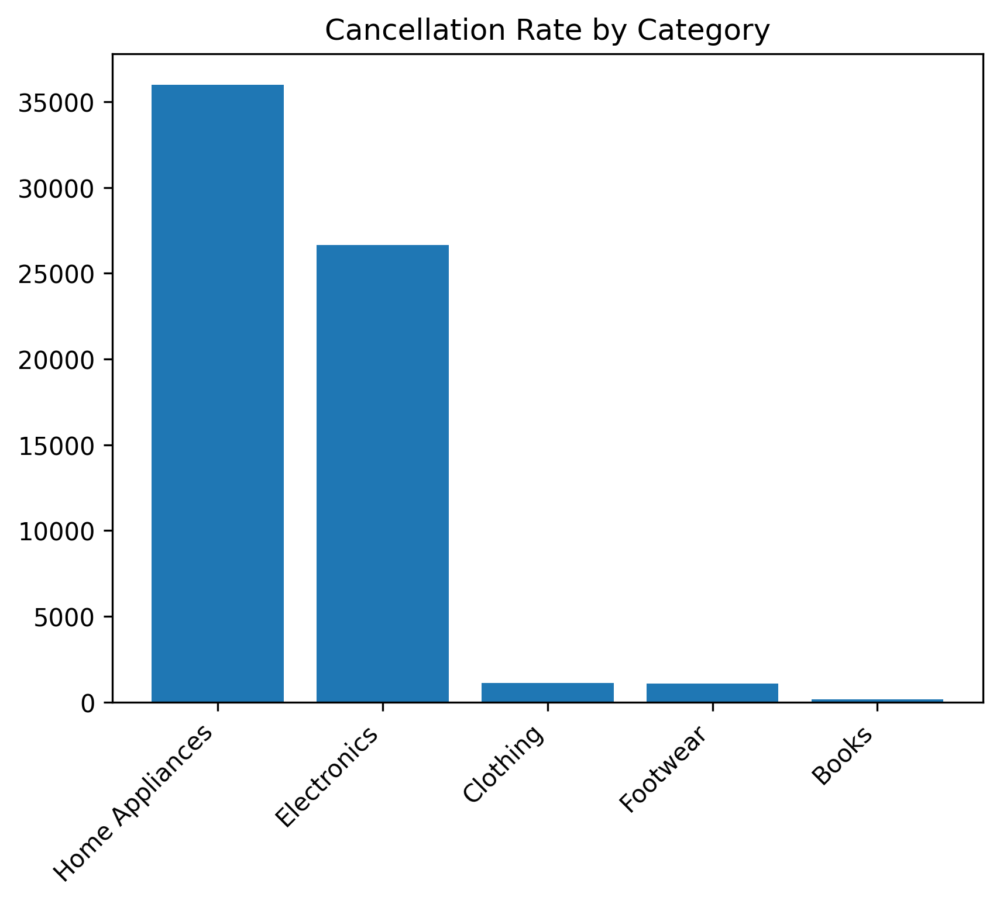
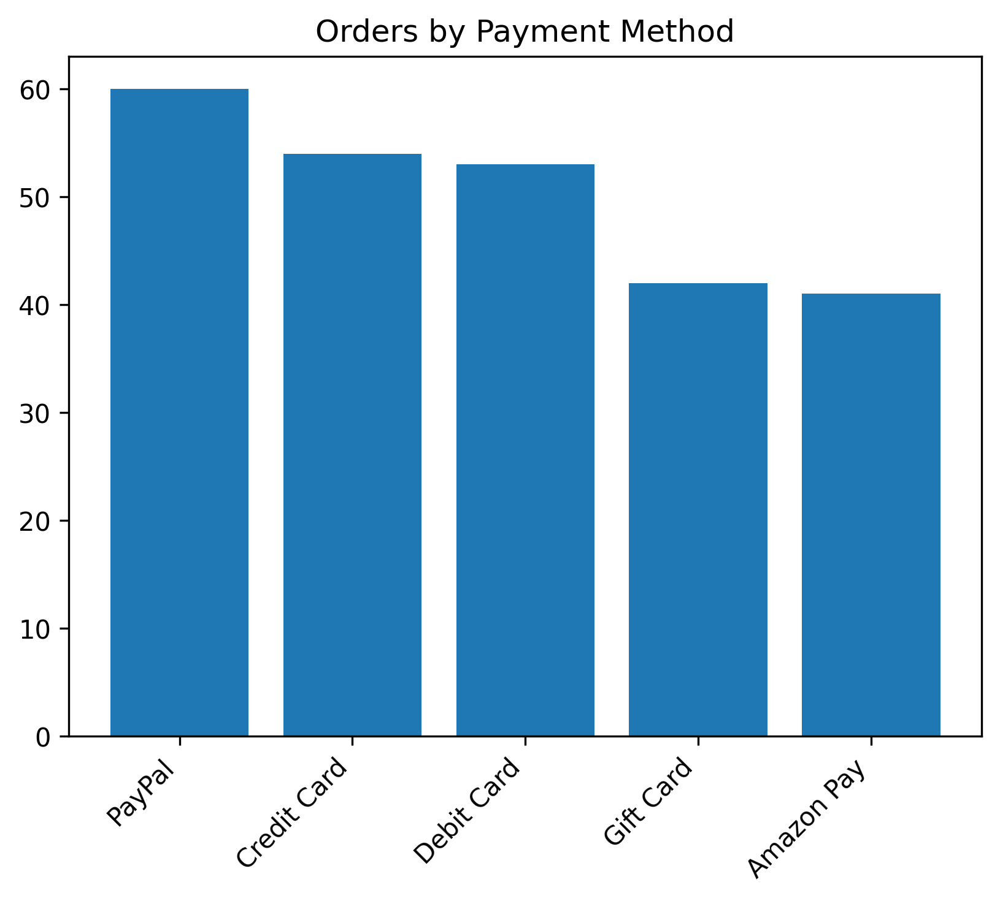
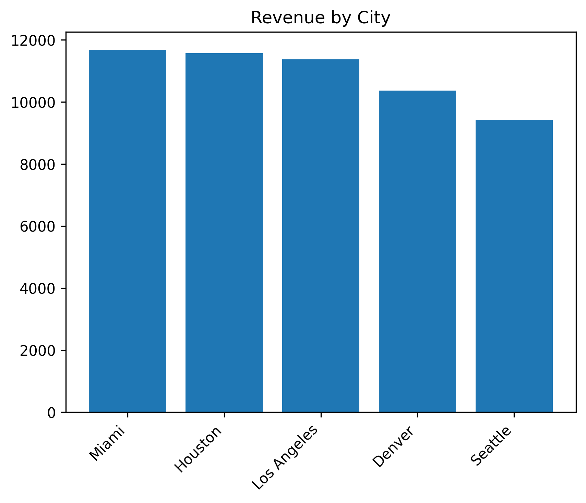

# 📊 Amazon Sales Data Analysis – 2025

## 📌 Project Overview
This project analyzes Amazon sales data for 2025 to understand sales performance, customer behavior, payment trends, and order cancellations.  

The goal is to extract actionable business insights that can help improve revenue, reduce cancellations, and optimize operational decisions.

This project simulates a real-world **Data Analyst business case study**.

---

## 🎯 Business Questions
The analysis aims to answer:

- What are the overall sales and revenue trends?
- Which categories generate the highest revenue?
- Which categories suffer from high cancellations?
- Which payment methods are most/least used?
- Do payment methods affect cancellation rates?
- Which cities contribute the most revenue?
- When do peak sales occur (monthly/daily)?

---

## 📂 Dataset
**Source:** Kaggle – Amazon Sales 2025  
**Link:** https://www.kaggle.com/datasets/zahidmughal2343/amazon-sales-2025/data

Main features:

| Column | Description |
|--------|-------------|
| Date | Order date |
| Product | Product name |
| Category | Product category |
| Price | Unit price |
| Quantity | Units sold |
| Total Sales | Revenue per order |
| Payment Method | Payment type |
| Status | Completed / Cancelled |
| City | Customer location |

---

## 🧹 Data Cleaning
- Converted Date to datetime format  
- Verified Total Sales = Price × Quantity  
- No duplicates found  
- No missing values  
- Added new features: Month, Day  

---

## 📊 Key KPIs

| Metric | Value |
|--------|----------|
| Total Orders | 714 |
| Completed Orders | 256 |
| Total Revenue | $88,530 |
| Average Order Value | $150 |

---

## 📈 Visualizations

### Monthly Revenue Trend

### Revenue by Category

### Revenue Share by Category

### Cancellation Rate by Category

### Orders by Payment Method

### Revenue by City (Top 5)

---

## 🔍 Key Insights

- Electronics dominate sales, contributing **63%+ of total revenue**
- February shows the highest monthly sales
- Day 6 records the highest daily revenue
- Home Appliances generate strong revenue but have high cancellation rates (~36%)
- Books category has very low performance and low completion rates
- PayPal is the most used payment method
- Debit Card shows the highest cancellation rate
- A few cities (Dallas, Denver, Boston) generate most of the revenue

---

## 💡 Recommendations

- Investigate high cancellation rates in Home Appliances
- Encourage adoption of Amazon Pay through incentives
- Improve or reassess the Books category
- Focus inventory on Electronics due to high demand
- Analyze causes of Debit Card payment failures

---

## 🛠 Tools & Technologies
- Python
- Pandas
- Matplotlib
- Jupyter Notebook

---

## 👤 Author

**Mina Ekramy**  
Computer Engineering Student | Aspiring Data Science and Machine learning

🔗 LinkedIn: https://linkedin.com/in/mina-ekramy
🔗 GitHub: https://github.com/minaekramy06
